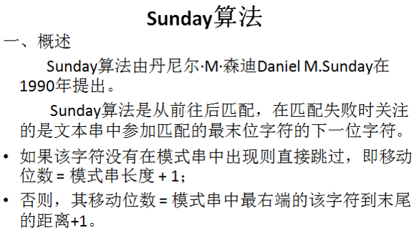
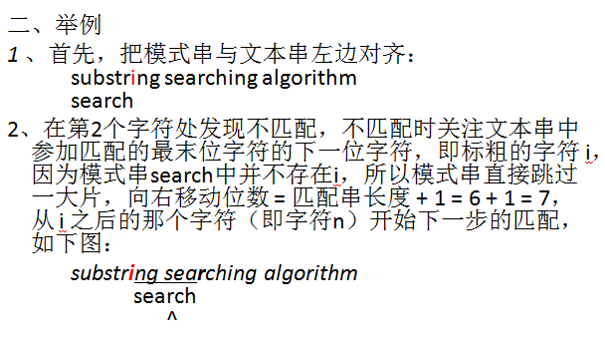
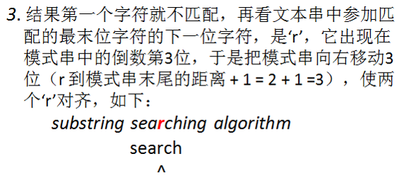

<!--
{
	"author": "lxf",
	"title": "模式匹配算法",
	"date": "2019-06-10 04:29:42",
	"category": "数据结构与算法"
}
-->

模式匹配算法
------------------------------------------------------------
一、BF：二维循环匹配算法  
代码实现：
```
/**
 * 二维循环匹配算法
 */
int BFSearch(const String& strText, const String& strSubText)
{
	int nTextLen = strText.length();
	int nSubTextLen = strSubText.length();
	if (nTextLen == 0 || nSubTextLen == 0 || nTextLen < nSubTextLen)
	{
		return -1;
	}
	int i = 0;
	int j = 0;
	while (i < nTextLen && j < nSubTextLen)
	{
		if (strText.at(i) == strSubText.at(j))
		{
			i++;
			j++;
		}
		else
		{
			i = i - j + 1;
			j = 0;
		}
	}
	if (j == nSubTextLen)
	{
		return i - j;
	}
	return -1;
}
```

二、Sunday算法  


  

算法实现：
```
#include <cstdio>
#include <string>

using String = std::string;

int SundaySearch(const String& strText, const String& strSubText)
{
	int nTextLen = strText.length();
	int nSubTextLen = strSubText.length();
	if (nTextLen == 0 || nSubTextLen == 0 || nTextLen < nSubTextLen)
	{
		return -1;
	}
	for (int i = 0; i <= nTextLen - nSubTextLen; i++)
	{
		int j = 0;
		while (j < nSubTextLen && strText.at(i + j) == strSubText.at(j))
		{
			j++;
		}
		if (j == nSubTextLen)
		{
			return i;
		}
		int k = nSubTextLen - 1; // 最右匹配原则
		while (k >= 0)
		{
			if (strText.at(i + nSubTextLen) == strSubText.at(k))
			{
				break;
			}
			k--;
		}
		{
			k = k < 0 ? 0 : k;
			i += nSubTextLen - k - 1;
		}
	}
	return -1;
}
```
------------------------------------------------------------
[返回上级目录](./../../../../categories/数据结构与算法/README.md)  |
[返回首页](./../../../../README.md)